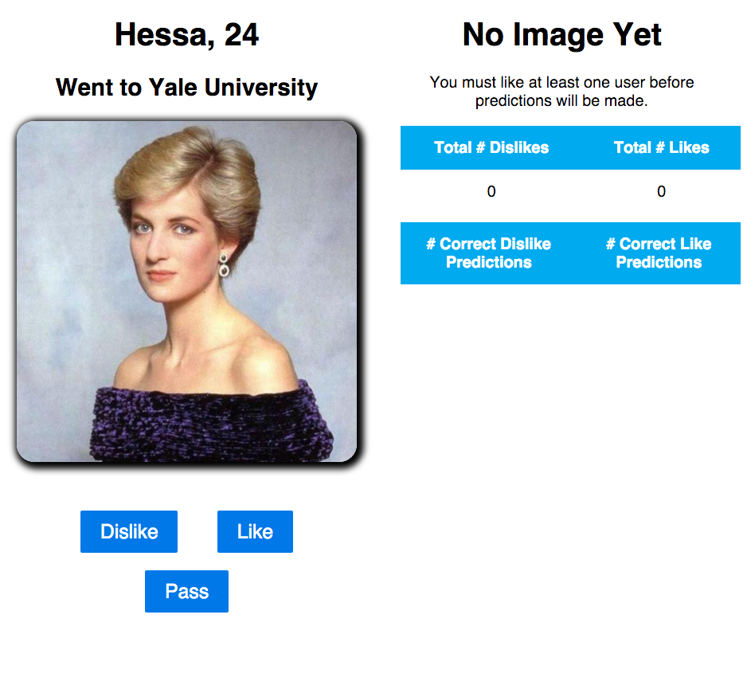
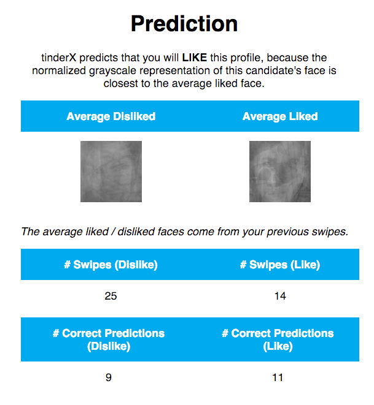
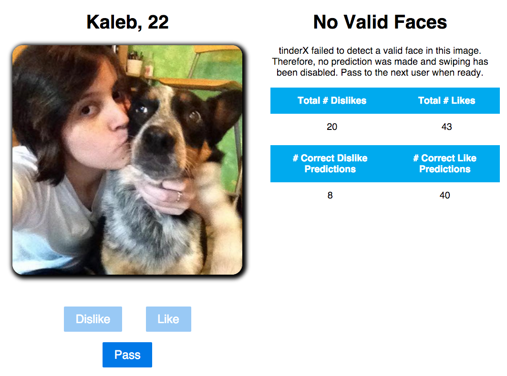

# tinderX

*This file is formatted in Markdown. I recommended either viewing it in an appropriate editor or opening the PDF version, which can be found in README.pdf.*

This project is hosted on GitHub, [https://github.com/charlierproctor/tinderx](https://github.com/charlierproctor/tinderx), and is running at [http://tinderx.charlieproctor.com](http://tinderx.charlieproctor.com).

## Overview

tinderX is an application built to learn your preferences for Tinder profiles. The core of the application lies in a series of Python modules (in the `core/` folder). These modules are made available through an API, written in Flask. Finally, there's a simple web interface, written in Angular, where users can interact with the algorithm.

To try it out, visit [http://tinderx.charlieproctor.com](http://tinderx.charlieproctor.com). See **Usage** for detailed instructions.

Here's how it works: tinderX observes as you like / dislike various Tinder profiles. As you do so, it constructs an average liked / disliked face... think of this as your "type". 

After you have liked / disliked at least one profile each, it will start to make predictions. If the candidate's face is closer to average liked face, the algorithm will predict a like. If the candidate's face is closer to the average disliked face, the agorithm will predict a dislike. 

See the section on **Image Processing** for a detailed description of how the images are handled / compared.

All profiles for tinderX come from the real Tinder app. I wrote a simple web scraper (`utils/scrape.py`) to sequentially guess and check short usernames... and then record the hits. For example, running `python -m utils.scrape 4` populates the database with valid Tinder usernames of `length < 4`. I then fetch usernames, ages, and profile pictures as necessary. One issue: I haven't figured out how to get the user's gender. So, for now, all genders are combined.


## Usage

To use tinderX, visit the following URL:

[http://tinderx.charlieproctor.com](http://tinderx.charlieproctor.com)

You are welcome to sign-in with your own Facebook account or one of the following test accounts:

| name | email | pwd |
|--------|--------|--------|
| Helen Alaakdeajacg Changsky | `muauibf_changsky_1450782672@tfbnw.net` | `tinderx` |
| Karen Alajijcjiaade Romanson | `yqnxffb_romanson_1450782670@tfbnw.net` | `tinderx` |
| John Alajhgbebdffb Yangescu | `zgxeqyy_yangescu_1450782668@tfbnw.net` | `tinderx` |
| Richard Alajhfaifehgh Zamoresky	 | `qhbgchf_zamoresky_1450782673@tfbnw.net` | `tinderx` |

Once you've signed in, you will be presented with a candidate on the left. At the top will be the candidate's name, age, and an optional 'teaser'. Then their profile picture. Underneath the profile picture, there are three buttons: `Dislike`, `Like`, and `Pass`.

On the right, you'll see a table of your likes / dislikes and the number of correct predictions made so far. Since you have yet to swipe on any images, no prediction will be made. You should see something like the following:



The `No Image Yet` message will display until you have both liked and disliked at least one profile.

Now let's suppose you want to 'like' this candidate. You can swipe right (click-and-drag) on the image itself, press the `Like` button, or press the right arrow key. Vice versa for dislike.

After swiping, you should be presented with a new candidate. Your statistics should update on the right. 

Now, keep doing this... after you have liked and disliked at least one candidate each, the algorithm will kick in and start to make predictions. The prediction appears on the right. 

Correctness statistics are updated as you progress. You'll also note that average liked / disliked faces are displayed: these are the images the candidate's face is compared against. If the candidate lies closer to the liked-average, the algorithm will predict a 'like'; if they lie close to the disliked-average, the algorithm will predict a 'dislike'.

Here's a screenshot of the righthand panel after a series of swipes:



## Errors

Along the way, you most likely encountered a `No Valid Faces` error. This means that the facial recognition algorithm failed to detect a valid face. In this case, your only option is to pass on the user. The profile will obviously not be factored into any of the statistics and the average images will remain unchanged. A sample of such an error is displayed here:



You may also run into the occasional OpenCV error... this could be from any number of image processing related issues! Just try reloading the page or passing on to the next user.

## Image Processing

The core image processing happens in the `core/profiles` module. There are two main actions:

1. update the average image to incorporate a new swipe; happens in `core/user/swipe.py`.
2. compare an image to an average, in order to make a prediction; happens in `core/user/fetch.py`

In both cases, we only care about the faces. In order to extract the faces, I take the following approach:

1. download the image from `http://images.gotinder.com/` convert it to grayscale
2. detect faces using the `haarcascade_frontalface_default.xml` cascaade classifier
3. detect eyes using the `haarcascade_eye.xml` cascaade classifier
4. calculate the pupils (the centers of the eyes)
5. calculate the best face: **the largest face, with at least one eye detected in it**
6. crop the image to be just that face
7. resize the image to be 100x100

Now, in `core/user/swipe.py`, to incorporate the face into the average, I use `cv2.addWeighted` with the appropriate weights. In `core/user/fetch.py`, I use a combination of `cv2.subtract` and `cv2.norm` to determine the difference between two images.

I'll quickly remark that there is **A LOT** of room for improvement here: especially when it comes to the face detection...

## Routes

Flask defines the following routes in `tinderx.py`, which act as the bridge between the core packages and the Angular frontend. Most API requests of interest are made in `app/controllers/swipe.js` (in Angular).

- `GET /`: send down the angular application (`index.html`)
- `POST /login`: log a user into the app
- `GET /fetch`: fetch a single user profile
- `POST /swipe`: allow a user to swipe left / right on a candidate
- `GET /img/<name>`: download liked.jpg or disliked.jpg for this user


## Directory Structure

### Top-Level

| Directory / File | Contents |
|-----------|----------|
| `app/` | contains the angular application. see detail below. | 
| `bower.json` | frontend dependencies, managed by `bower`. |
| `config/` | app constants, sample config files for mongo, apache |
| `core/` | contains the core of the Python application: maintain a user's account, fetch / swipe on profiles, interact with database, etc. see detail below. |
| `docs/` | my original proposal |
| `lib/opencv3/haarcascades/` | the cascaade classifiers used for face / eye detection |
| `package.json` | node dependencies (mainly just `gulp`) |
| `requirements.txt` | backend (Python / Flask) dependencies |
| `tinderx.py` | the Flask interface (defines the server) |
| `tinderx.wsgi` | WSGI file for deploying application using Apache |
| `utils/` | contains utilities for scraping usernames and showing images |
| `utils/scrape.py` | scrape usernames off gotinder.com |
| `utils/show.py` | show the liked or disliked image locally (in a pop-up window) |

### Angular Application

| Directory / File | Contents |
|-----------|----------|
| `app/app.js` | defines the application |
| `app/bower_components/` | all the application dependencies |
| `app/controllers` | the controllers: `login.js`, `swipe.js` |
| `app/css` | the styling |
| `app/directives` | contains the `swipeable` directive (allows you to swipe on cards) |
| `app/index.html` | the base page |
| `app/partials` | the HTML views: `login.html`, `swipe.html` |

### Core Package

| Directory / File | Contents |
|-----------|----------|
| `core/errors` | defines a series of app-wide errors |
| `core/db/` | a package of database functions |
| `core/db/profiles.py` | functions to interact with the `tinder_profiles` document in MongoDB |
| `core/db/users.py` | functions to interact with the `users` document in MongoDB |
| `core/user/` | defines the `User` class. authorize a user, fetch a profile, swipe on a profile. |
| `core/user/auth.py` | authorize a user (verify their facebook tokens) |
| `core/user/fetch.py` | fetch the next profile, predict whether the user will like it |
| `core/user/swipe.py` | swipe on a profile, updating the liked or disliked average image |
| `core/profile/` | defines the `Profile` class. detect faces, normalize images. |
| `core/profile/detect.py` | detect faces / eyes. choose which face we should use. |
| `core/profile/img.py` | download images, normalize them: crop, resize, etc. |
| `core/profile/run.py` | run face detection locally, displaying the results in a pop-up window. |

## Installation

Unfortunately, as tinderX involves multiple languages and a variety of technologies, there are a number of complicated dependencies. That being said, I'll outline the highlights here. Obviously, the details are system-dependent.

First and foremost, you must have some form of **Python 2.7**.

### opencv3

To process the images (detect faces, crop, resize, etc.), I use **OpenCV 3**. This is a nightmare to install... if you're on a Mac, [brew](http://brew.sh/) works. Otherwise, here are instructions for linux installation from source:

[http://docs.opencv.org/3.0-beta/doc/tutorials/introduction/linux_install/linux_install.html](http://docs.opencv.org/3.0-beta/doc/tutorials/introduction/linux_install/linux_install.html)

You have to make sure to install the appropriate Python bindings.

### pip

There are a series of Python packages, as listed in `requirements.txt`, that must be installed:

```
pip install -r requirements.txt
```

These include:

```
facepy==1.0.7				## Facebook SDK: used to validate authentication tokens
Flask==0.10.1				## Flask itself
lxml==3.5.0				## parses the HTML responses from Tinder in scrape.py
numpy==1.10.1				## helps process the images (all opencv images are multidimensional matrices)
pymongo==3.1.1			## mongodb driver
requests==2.8.1			## make HTTP requests (used in scrape.py)
```

### mongodb

I use MongoDB to store information on the users and the profiles. I'm using `v3.0.8`, but anything close should work too. Installation instructions can be found here:

[https://docs.mongodb.org/v3.0/installation/](https://docs.mongodb.org/v3.0/installation/)

A sample `mongod.conf` is located in the `config/` folder.

### nodejs

I'm using `NodeJS v4.2.3`, but anything thereabouts should work too. Node is just used for `gulp`, as described in the next section.

### gulp

I use `gulp` to manage the build process of the angular frontend. As you can see in `index.html`, all js / css is concatenated down into `lib.css`, `app.css`, `lib.js`, and `app.js`. Gulp handles this process.

To install gulp, 

```
npm install
```

To rebuild the angular frontend after any changes, just run the `gulp` command. `gulp watch` works too.


### apache

In production, I've been using Apache, with the `mod_wsgi` library installed. A sample apache config file can be found in `config/001-tinderx.conf` and a sample wsgi file in `tinderx.wsgi`.

### run

If on a local machine, you can also run the app directly:

```
python tinderx.py
```